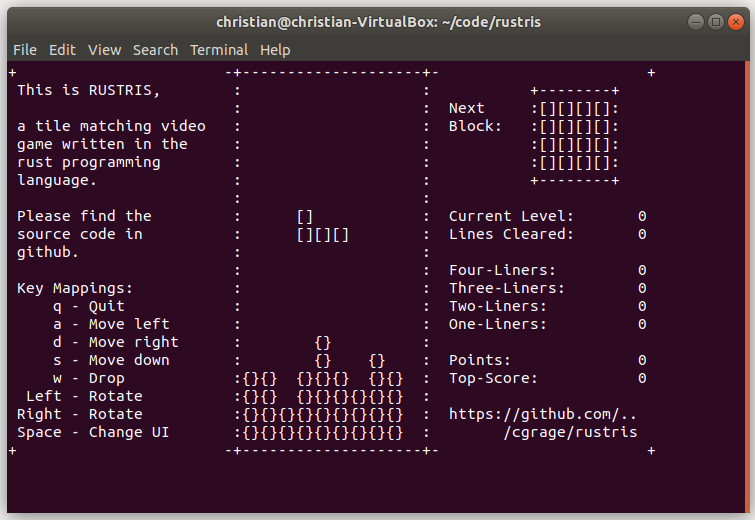

# RUSTRIS

Rustris is a tile matching video game written in the rust programming language.



## Build

Build with 'cargo build' in the top level directory:

```bash
cargo build
```

## Run

Run the built game by starting the debug executable:

```bash
./target/debug/rustris
```
